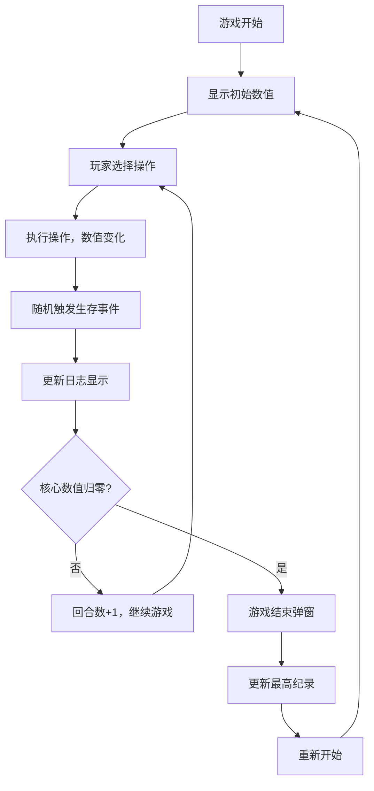

## 1. 产品概述

一款基于 Vue 3 的网页生存小游戏，玩家通过采集资源、管理生存数值来尽可能存活更多回合。游戏采用深色主题，卡片式布局，操作简单，随机事件增加趣味性。
- 核心目标：管理生命值、饥饿值、口渴值三项核心数值不归零，尽可能存活更多回合
- 目标用户：休闲游戏爱好者、网页小游戏玩家
- 产品价值：提供轻松有趣的生存模拟体验，考验资源管理与随机事件决策的乐趣

## 2. 核心功能

### 2.1 功能模块
1. **游戏主界面：状态栏、操作区、日志区
2. **数值系统：生命值、饥饿值、口渴值、木材、石头
3. **操作系统：采集木头、采集石头、打猎、喝水
4. **事件系统：每次操作后随机触发生存事件
5. **游戏结束：所有核心数值归零后显示结束弹窗
6. **记录系统：localStorage 保存最高生存回合数

### 2.2 页面详情

| 页面名称 | 模块名称 | 功能描述 |
|---------|---------|---------|
| 游戏主页面 | 状态栏 | 显示生命值、饥饿值、口渴值、木材、石头五项数值，带进度条或数字展示 |
| 游戏主页面 | 操作按钮区 | 四个操作按钮：采集木头、采集石头、打猎、喝水 |
| 游戏主页面 | 事件日志区 | 显示操作结果和随机事件文字反馈 |
| 游戏主页面 | 回合数与最高纪录 | 显示当前回合数和历史最高纪录 |
| 游戏主页面 | 游戏结束弹窗 | 显示游戏结束、最终回合并提供重新开始按钮 |

## 3. 核心流程

玩家进入游戏 → 查看当前数值 → 选择操作（采集/打猎/喝水 → 数值变化 → 随机事件触发 → 日志更新 → 判断游戏继续或结束 → 游戏结束弹窗 → 重新开始

## 4. 用户界面设计

### 4.1 设计风格

- **主色调**：深色背景（深灰/近黑），卡片式布局
- **强调色**：生命值-红色、饥饿值-橙色、口渴值-蓝色、木材-棕色、石头-灰色
- **按钮风格**：圆角卡片式按钮，带有悬停动效
- **字体**：现代无衬线字体，数字清晰醒目
- **布局风格**：三栏卡片布局（状态区、操作区、日志区
- **图标/emoji**：使用 emoji 图标增加趣味性（❤️、🍖、💧、🪵、🪨）

### 4.2 页面设计概述

| 页面名称 | 模块名称 | UI 元素 |
|---------|---------|---------|
| 游戏主页面 | 状态栏卡片 | 深色卡片背景，五条进度条，数值标签，emoji 图标 |
| 游戏主页面 | 操作按钮卡片 | 四个大按钮，2x2 网格，悬停缩放动效 |
| 游戏主页面 | 日志卡片 | 固定高度，内部滚动，文字逐行出现 |
| 游戏主页面 | 顶部信息 | 回合数与最高纪录 |
| 游戏主页面 | 结束弹窗 | 居中模态框，遮罩层，重新开始按钮 |

### 4.3 响应式

桌面端三栏布局，移动端自适应堆叠布局，触控友好的按钮尺寸。

### 4.4 动效设计

- 按钮悬停缩放与阴影
- 数值变化时的数字跳动动效
- 日志条目淡入效果
- 游戏结束弹窗的淡入缩放
