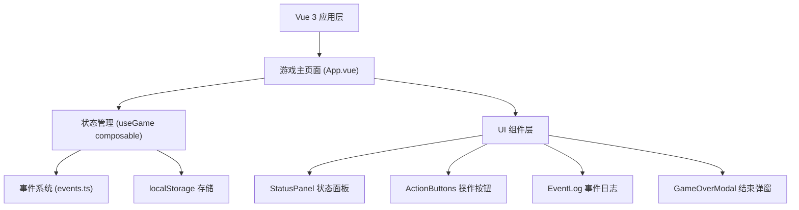

## 1. 架构设计



## 2. 技术描述

- **前端框架**：Vue 3 + Composition API + TypeScript
- **构建工具**：Vite
- **样式方案**：Tailwind CSS 3
- **状态管理**：Vue Composables（useGame）
- **数据持久化**：localStorage
- **无后端、纯前端应用**

## 3. 项目结构

```
src/
├── App.vue                 # 主应用组件
├── main.ts                 # 入口文件
├── style.css               # 全局样式
├── components/
│   ├── StatusPanel.vue     # 状态面板组件
│   ├── ActionButtons.vue   # 操作按钮组件
│   ├── EventLog.vue        # 事件日志组件
│   └── GameOverModal.vue   # 游戏结束弹窗
├── composables/
│   └── useGame.ts          # 游戏核心逻辑 composable
├── data/
│   └── events.ts           # 随机事件数据
└── types/
    └── game.ts             # 类型定义
```

## 4. 数据模型

### 游戏状态

```typescript
interface GameState {
  health: number;      // 生命值 0-100
  hunger: number;      // 饥饿值 0-100
  thirst: number;      // 口渴值 0-100
  wood: number;        // 木材
  stone: number;       // 石头
  turn: number;        // 当前回合数
  isGameOver: boolean; // 游戏是否结束
  logs: LogEntry[];    // 日志列表
}

interface LogEntry {
  id: number;
  text: string;
  type: 'action' | 'event' | 'system';
  turn: number;
}

interface RandomEvent {
  id: string;
  text: string;
  type: 'good' | 'bad' | 'neutral';
  effects: {
    health?: number;
    hunger?: number;
    thirst?: number;
    wood?: number;
    stone?: number;
  };
}
```

## 5. 操作效果定义

| 操作 | 生命值 | 饥饿值 | 口渴值 | 木材 | 石头 |
|-----|--------|--------|--------|------|------|
| 采集木头 | -5 | +5 | +3 | +10 | 0 |
| 采集石头 | -8 | +6 | +4 | 0 | +8 |
| 打猎 | +15 | -20 | +5 | -5 | 0 |
| 喝水 | 0 | +2 | -25 | -3 | 0 |

## 6. 随机事件

- 野兽袭击：生命值 -15
- 发现浆果：饥饿值 -10
- 找到泉水：口渴值 -15
- 天气变冷：生命值 -5, 木材 -5
- 发现废弃营地：木材 +8, 石头 +5
- 踩到陷阱：生命值 -10
- 找到食物储藏：饥饿值 -20
- 下雨：口渴值 -10
